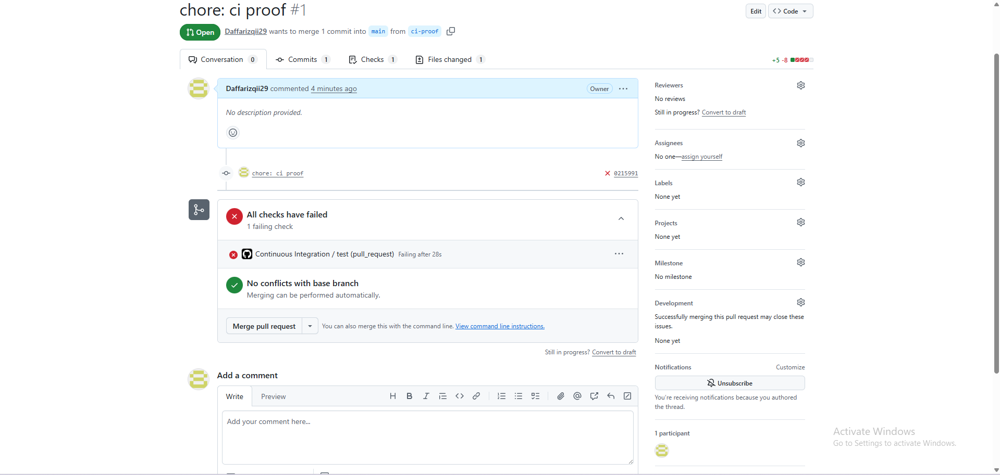
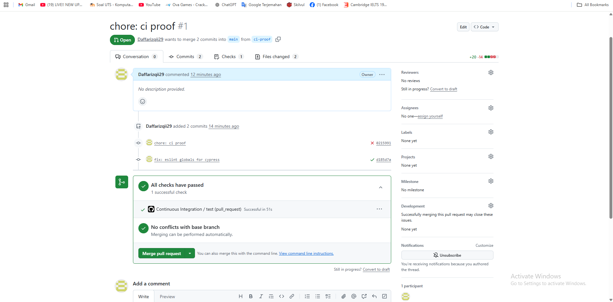
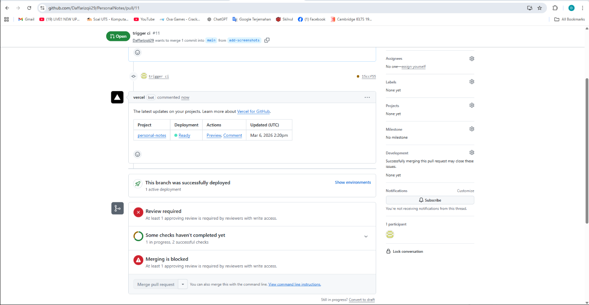

# RuangDiskusi (React + Redux)

Aplikasi **Forum Diskusi** yang menggunakan **Dicoding Forum API**.

## Fitur Utama
- Register
- Login
- Daftar thread (judul, potongan body, waktu, jumlah komentar, info pembuat)
- Detail thread + komentar
- Buat thread (wajib login)
- Buat komentar (wajib login)
- Loading indicator saat memuat data

## Fitur Tambahan (Supaya Unggul)
- Vote thread & komentar (up/down + indikator bila sudah vote)
- Optimistic update untuk vote
- Leaderboard
- Filter thread berdasarkan kategori (client-side)

## Cara Menjalankan
1. Install dependencies
   ```bash
   npm install
   ```
2. Jalankan dev server
   ```bash
   npm run dev
   ```
3. Buka URL yang muncul (default: http://localhost:5173)

## Konfigurasi Opsional
Secara default aplikasi memakai:
- `https://forum-api.dicoding.dev/v1`

Kalau ingin mengganti base URL, buat file `.env`:
```env
VITE_API_BASE_URL=https://forum-api.dicoding.dev/v1
```

## Linting
```bash
npm run lint
```

## Catatan Arsitektur
- Pemanggilan REST API ada di `src/state/*Slice.js` (async thunk) dan `src/api/forumApi.js`.
- Komponen UI tidak memanggil API langsung.
- State dari API disimpan di Redux Store.


## Automation Testing
Perintah untuk menjalankan pengujian:

- Unit/Component Test
  ```bash
  npm test
  ```

- End-to-End Test (Cypress)
  ```bash
  npm run e2e
  ```

Struktur berkas pengujian:
- Reducer tests: `src/state/__tests__/*reducer*.test.js`
- Thunk tests: `src/state/__tests__/*thunk*.test.js`
- Component tests: `src/ui/components/__tests__/*.test.jsx`
- E2E login flow: `cypress/e2e/login.cy.js`

> Catatan: setiap berkas test sudah mencantumkan **Skenario Pengujian** pada blok komentar teratas, sesuai kriteria.

## CI/CD (GitHub Actions + Vercel)
- Continuous Integration (CI) menggunakan GitHub Actions: `.github/workflows/ci.yml`
  - Menjalankan lint, unit/component tests, dan e2e (Cypress) untuk setiap push/PR ke `main/master`.
- Continuous Deployment (CD) menggunakan Vercel
  - Hubungkan repository ke Vercel (Import Project), lalu set Framework preset: **Vite**.
  - Build command: `npm run build`
  - Output directory: `dist`

### Branch Protection (main/master)
Aktifkan Branch Protection melalui:
`Settings` → `Branches` → `Branch protection rules` → `Add rule`

Rekomendasi minimum:
- ✅ Require a pull request before merging
- ✅ Require status checks to pass before merging
  - Pilih check: **Continuous Integration**
- (Opsional) ✅ Require approvals (1)

## Bukti Screenshot (untuk submission)
Lampirkan 3 screenshot berikut di folder `/screenshot` dan tampilkan di README:

- `1_ci_check_error.png` (CI check error)
- `2_ci_check_pass.png` (CI check pass)
- `3_branch_protection.png` (branch protection di halaman PR)

Contoh penempatan:
## Bukti CI/CD & Branch Protection




## URL Deployment (Vercel)
Tempel URL Vercel kamu di bagian ini setelah deploy:
- Vercel URL: (https://personal-notes-wine.vercel.app/)
